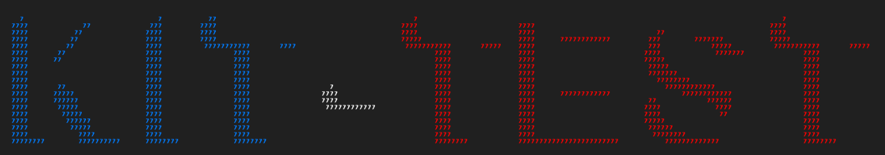

<div style="text-align: center;">
    
</div>

# Kit-Test (Dpt. PyMoX) [](https://github.com/PyMoX-fr/Kit_Test)

<div align="center" style="margin-top: 0px">
  <!-- Ligne OS -->
  <div style="margin: 0;">
    
    
    <a href="https://learn.microsoft.com/fr-fr/powershell/scripting/install/install-powershell-on-windows?view=powershell-7.5" title="Cliquer ICI pour installer cette version" target="_blank"></a>
    
  </div>
  
  <!-- Ligne autres badges -->
  <div style="margin: 0;">
    <a href="https://www.python.org">
      
    </a>
    <a href="https://pymox.fr/outils/logs/CHANGELOG">
      
    </a>
    <a href="https://pypi.org/project/pymox-kit">
      
    </a>
    </div>
    <div style="margin: 0;">
    <a href="https://github.com/PyMoX-fr/Kit">
      
    </a>
  </div>

</div>

Un simple et petit dépôt GH public pour tester **PyMox_Kit**, une lib à laquelle vous pouvez aussi contribuer, tout comme le Projet de base: **[PyMoX.fr](http://PyMoX.fr)**.

<!-- ❌ add ctrl + alt + l/w shortcuts 4 linux & win icons ds vsc -->

## Exemple de fonctions à venir dans PyMox-Kit


## I / Installation

🪟

  ```bash
  git clone https://github.com/PyMoX-fr/Kit_Test.git
  cd Kit_Test
  ./start
  ```

🐧

```bash
git clone https://github.com/PyMoX-fr/Kit_Test.git

cd Kit_Test
//2do Étapes précises Linux
...
```

(CTRL + C pour quitter)

## II / Enjoy ! 😊

----

## Tips

### 🐧

#### 1. Si besoin d'utiliser python3.12 max & y installer les libs

Exemple pour Win (Adapter si autre OS) :

1. Décompresser https://www.python.org/ftp/python/3.12.10/python-3.12.10-amd64.zip
dans C:\python312\

2. Fais ton virtual environment (.VEnv) avec ce 'vieux' Python

    ```bash
    C:\python312\python.exe -m venv .venv

    .venv\Scripts\python.exe -m pip install --upgrade pip

    pip install -r requirements
    ```

#### 2. CLI PowerShell v7.5.4 + (Accentuée & colorisée)

1. Vérif version installée :

    ```bash
    $PSVersionTable.PSVersion
    ```

2. Si pas 7.5.4+ :<a href="https://learn.microsoft.com/fr-fr/powershell/scripting/install/install-powershell-on-windows?view=powershell-7.5" title="Cliquer ICI pour installer cette version" target="_blank"></a>

### 🪟

#### 1. Si besoin d'utiliser python3.12 max & y installer les libs

Exemple pour Win (Adapter si autre OS) :

1. Décompresser https://www.python.org/ftp/python/3.12.10/python-3.12.10-amd64.zip
dans C:\python312\

2. Fais ton virtual environment (.VEnv) avec ce 'vieux' Python

    ```bash
    C:\python312\python.exe -m venv .venv

    .venv\Scripts\python.exe -m pip install --upgrade pip

    pip install -r requirements
    ```

#### 2. CLI PowerShell v7.5.4 + (Accentuée & colorisée)

1. Vérif version installée :

    ```bash
    $PSVersionTable.PSVersion
    ```

2. Si pas 7.5.4+ :<a href="https://learn.microsoft.com/fr-fr/powershell/scripting/install/install-powershell-on-windows?view=powershell-7.5" title="Cliquer ICI pour installer cette version" target="_blank"></a>

---

[](https://github.com/orgs/PyMoX-fr/repositories)

### 🍎

?
